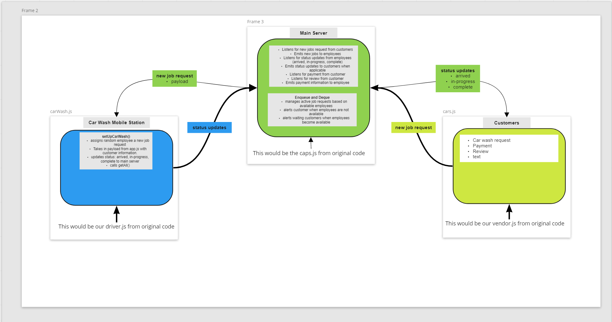

# Car Wash Plug

## Event Driven Applications

### Requirements

Your application must employ the following programming concepts:
1. A “hub” server that moderates all events
2. Multiple “clients” that connect to the hub which can both publish and subscribe to events
3. Must operate over a network

### Optional

- Engage an API that uses a database to store/retrieve information based on the events being triggered
- Employ a standard “Queue” to ensure all messages are properly delivered
- Employ a FIFO “Queue” to ensure ordered delivery of some events

## Team Car Wash Plug 🏎️ 🧼 🔌

- Danny Castor
- Martha Quintanilla-Ramirez
- Tony Regalado
- Sarah Teklemariam

## Project Idea
- Our project is to create a Car Wash Station where customers drop off their vehicles and waits for a notification when the car wash is completed. We are implementing rooms

## Pull Request

- [PR](https://github.com/carWashPlug/carWashPlug/pull/4)

## Starting Up

In terminal run npm i to install dependencies.
run:
  - npm run server
  - npm run employee
  - npm run customer
  
## UML

  